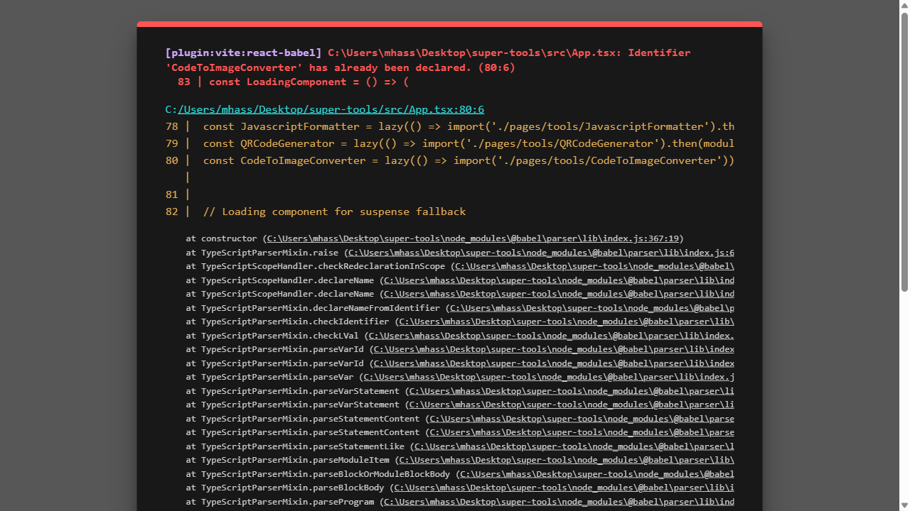
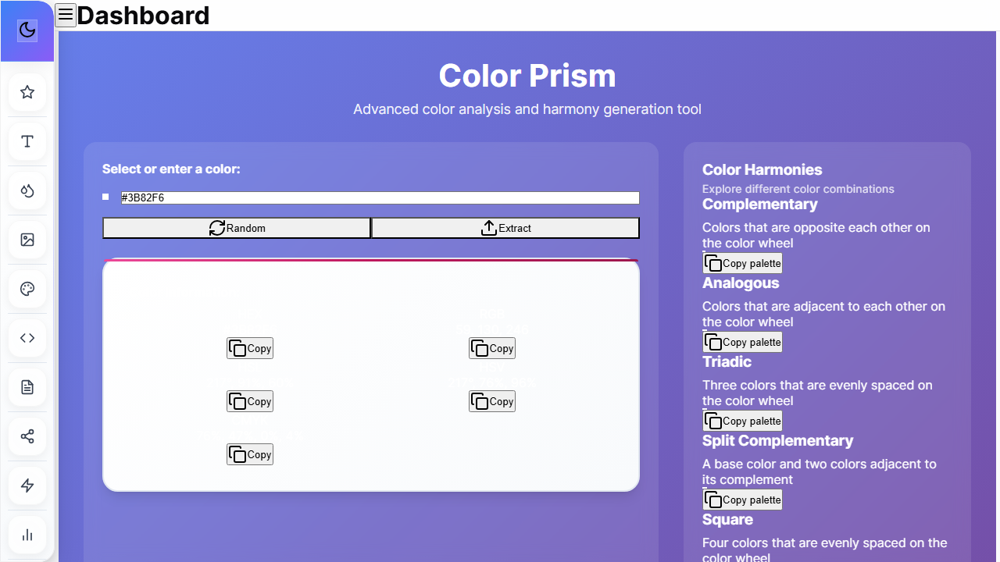
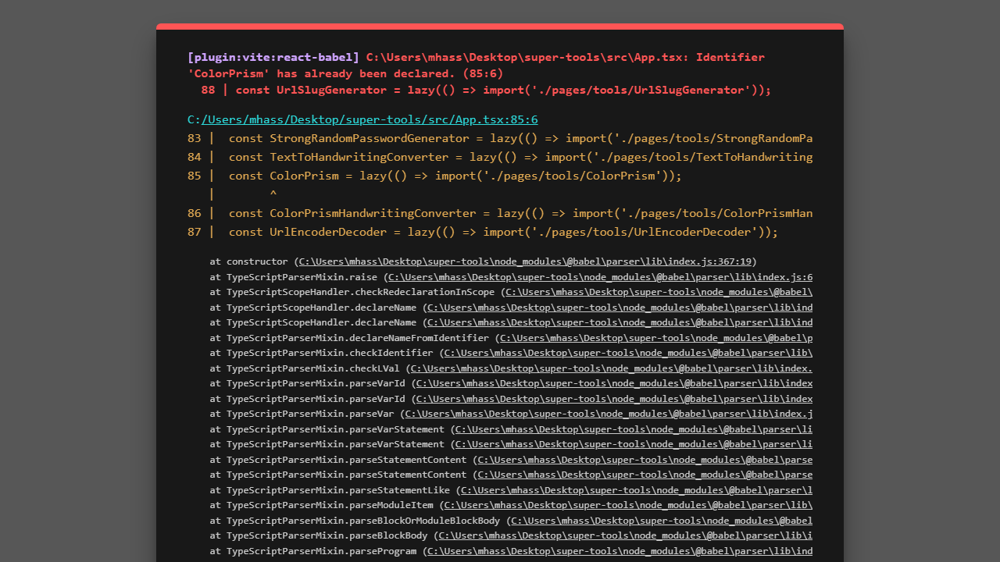
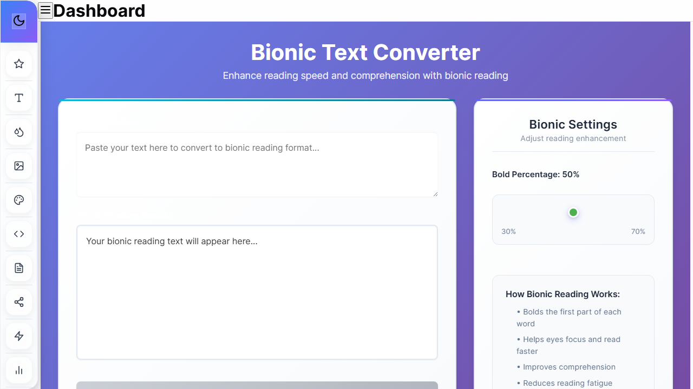
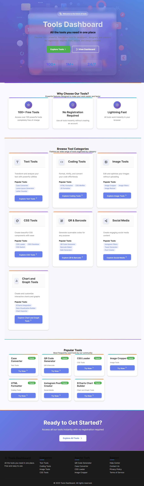

# Super Tools Dashboard 🚀

<p align="center">
  
</p>

<p align="center">
  <strong>A modern, professional collection of 100+ web tools built with React, TypeScript, and glassmorphism design.</strong>
</p>

<p align="center">
  <a href="#features">Features</a> •
  <a href="#tool-categories">Tool Categories</a> •
  <a href="#quick-start">Quick Start</a> •
  <a href="#tech-stack">Tech Stack</a> •
  <a href="#contributing">Contributing</a>
</p>

<p align="center">
  
  
  
  
</p>

## 🌟 Overview

Super Tools Dashboard is a comprehensive collection of over 100 professional web tools designed for developers, designers, content creators, and business professionals. With a sleek glassmorphism UI and powerful functionality, it's the ultimate toolkit for your daily tasks.

<p align="center">
  
</p>

## ✨ Features

| Feature | Description |
|--------|-------------|
| 🎨 **Glassmorphism UI** | Beautiful frosted glass effects throughout the interface |
| 🌙 **Dark/Light Mode** | Automatic system preference detection with manual toggle |
| 📱 **Fully Responsive** | Works seamlessly on desktop, tablet, and mobile devices |
| ⚡ **Real-time Previews** | See changes instantly as you customize tools |
| 🔒 **Privacy Focused** | All processing happens locally in your browser |
| 🚀 **No Registration** | Access all tools instantly without signing up |
| 📤 **Export Functionality** | Download your creations in various formats |

## 🛠️ Tool Categories

### 📝 Text Tools
Transform and manipulate text with ease:
- Case Converter
- Lorem Ipsum Generator
- Character Counter
- Handwriting Generator
- Bionic Reading Converter
- Whitespace Cleaner
- Font Pairing Finder
- Letter Counter
- Bulk Text Processing Tools

### 🖼️ Image Tools
Professional image processing capabilities:
- Image Cropper/Trimmer
- Photo Filters
- Image Resizer
- Color Extractor
- Average Color Finder
- Color Picker
- Image Background Remover
- Instagram Photo Downloader

### 🎨 CSS Tools
Create stunning CSS components:
- Loader Generator (10+ types)
- Checkbox Generator (8+ styles)
- Switch Generator (8+ styles)
- Clip Path Generator (16+ shapes)
- **Glassmorphism Generator**
- Background Pattern Generator
- Cubic Bezier Generator
- CSS Formatter & Minifier
- **Button Generator** - Create beautiful CSS buttons with live preview
- **Card Designer** - Design elegant cards with customization options
- **Loading Animation Generator** - Generate CSS loading animations
- **UI Component Library** - Browse and customize UI components

### 💻 Developer Tools
Essential tools for developers:
- **Code Screenshot Generator**
- URL Slug Generator
- React Native Shadow Generator
- Base64 Encoder/Decoder
- HTML Encoder/Decoder
- URL Encoder/Decoder
- HTML Formatter & Minifier
- JavaScript Formatter & Minifier
- JSON Tree Viewer
- JWT Encoder/Decoder
- Encryption/Decryption Tools (MD5, SHA1, SHA256, etc.)

### 📊 Data Visualization Tools
Visualize data effectively:
- Chart Builder (10+ chart types)
- Data Export Tools
- Visualization Customization

### 📱 Social Media Tools
Create social media content:
- Instagram Filters
- Instagram Post Generator
- Tweet Generator
- Tweet to Image Converter

### 💼 Business Tools
Powerful business utilities:
- Lead Generator
- Email Validator
- Company Profiler
- **AI Lead Generation** - Scrape business leads from Google Maps and generate AI-powered marketing content

### 🔧 Miscellaneous Tools
Various utility tools:
- Password Generator
- List Randomizer
- QR Code Generator
- Barcode Generator
- Strong Password Generator

## 🚀 Quick Start

### Prerequisites
- Node.js (version 14 or higher)
- npm or yarn

### Installation

```bash
# Clone repository
git clone https://github.com/Aas112233/super-tools.git

# Navigate to project directory
cd super-tools

# Install dependencies
npm install

# Start development server
npm run dev
```

### Building for Production

```bash
# Build the project
npm run build

# Preview the production build
npm run preview
```

## 🎯 Highlights

### 🎨 UI/UX Excellence
<p align="center">
  
</p>

### 💻 Developer Tools Showcase
Our powerful code screenshot generator with syntax highlighting:
<p align="center">
  
</p>

### 🎨 CSS Component Generators
Create beautiful UI components with live preview:
<p align="center">
  
</p>

### 🆕 New Component Tools
Our latest additions to the CSS tools category:

#### Button Generator
Create beautiful CSS buttons with live preview and customization options:
<p align="center">
  
</p>

#### Card Designer
Design elegant cards with customization options:
<p align="center">
  
</p>

#### Loading Animation Generator
Generate CSS loading animations with various styles:
<p align="center">
  
</p>

## 📦 Tech Stack

| Category | Technologies |
|----------|-------------|
| **Frontend** | React 18, TypeScript, TailwindCSS |
| **Build Tool** | Vite |
| **Styling** | CSS3, Glassmorphism |
| **Icons** | Lucide React |
| **Charts** | ECharts |
| **Image Processing** | html2canvas, react-image-file-resizer |
| **State Management** | React Context API |
| **Routing** | React Router |
| **Code Formatting** | Prettier |
| **Linting** | ESLint |

## 📁 Project Structure

```
super-tools/
├── src/
│   ├── components/     # Reusable UI components
│   ├── pages/          # Page components and tools
│   │   └── tools/      # Individual tool components
│   ├── utils/          # Utility functions
│   ├── contexts/       # React contexts
│   ├── assets/         # Static assets
│   └── App.tsx         # Main application component
├── public/             # Static files
├── dist/               # Production build output
└── ...
```

## 🤝 Contributing

Contributions are what make the open source community such an amazing place to learn, inspire, and create. Any contributions you make are **greatly appreciated**.

1. Fork the repository
2. Create feature branch (`git checkout -b feature/amazing-tool`)
3. Commit changes (`git commit -m 'Add amazing tool'`)
4. Push to branch (`git push origin feature/amazing-tool`)
5. Open Pull Request

### Adding New Tools

1. Create a new component in `src/pages/tools/`
2. Add the tool to the appropriate category in `src/components/DashboardContent.tsx`
3. Test the tool functionality
4. Submit a pull request

## 📄 License

MIT License - feel free to use this project for personal or commercial purposes.

## 🙏 Acknowledgments

- Inspired by various open-source tool libraries
- Built with modern web technologies
- Designed for developers and content creators

## 🔒 Privacy & Security

All tools process data locally in your browser. No data is sent to any server, ensuring your privacy and security. We do not collect, store, or transmit any personal information.

---

<p align="center">
  
</p>

<p align="center">
  ⭐ <strong>Star this repo if you find it useful!</strong> ⭐
</p>

<p align="center">
  <a href="https://github.com/Aas112233/super-tools/stargazers">
    
  </a>
  <a href="https://github.com/Aas112233/super-tools/network">
    
  </a>
</p>